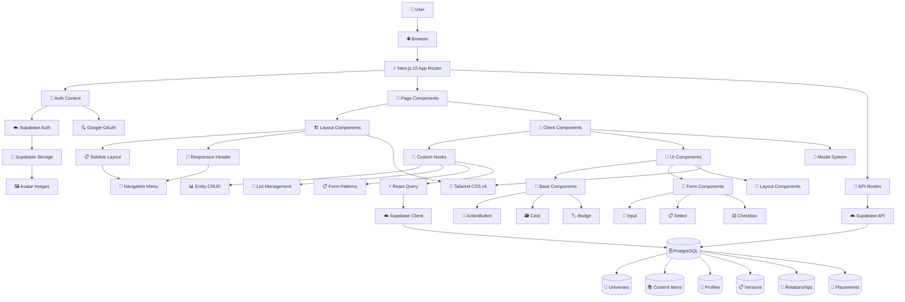
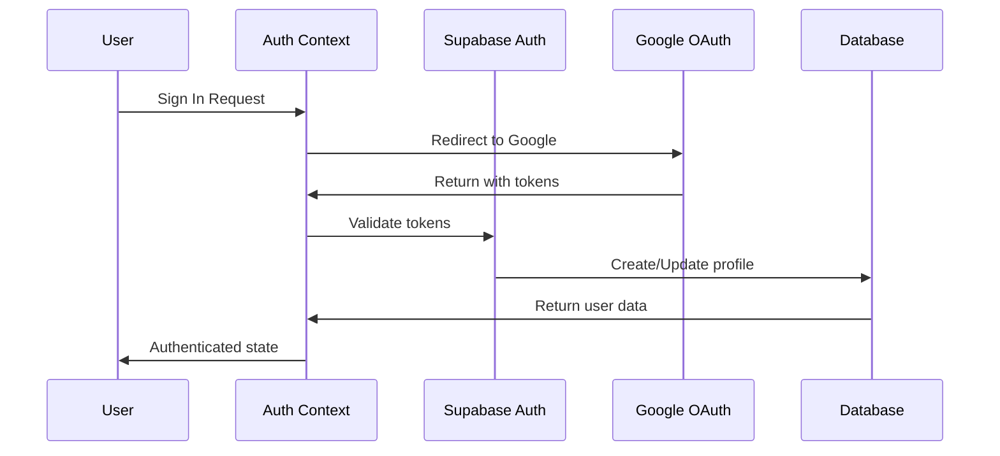
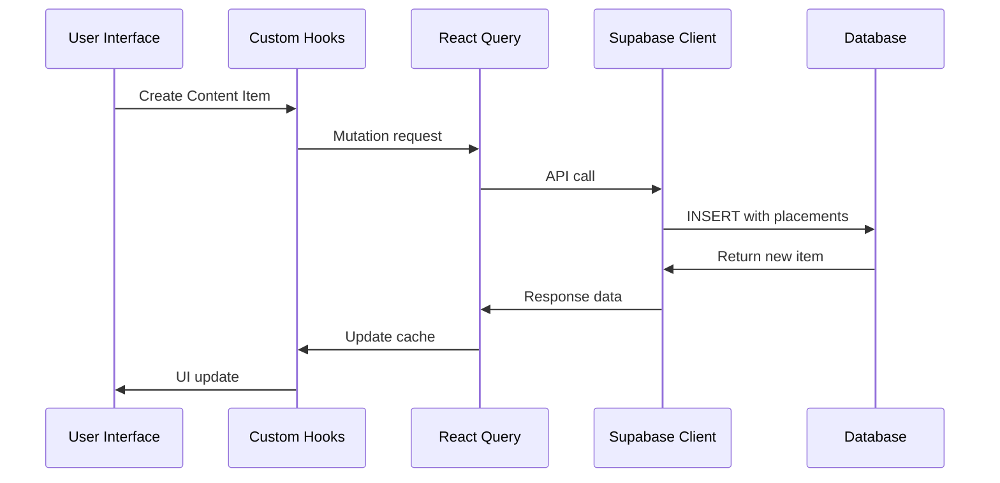
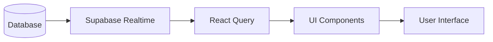
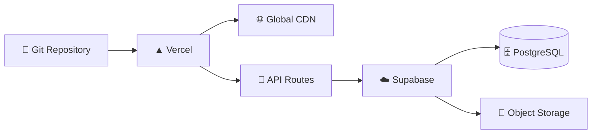

# CanonCore Architecture Guide

## Overview

 CanonCore is a modern content organisation platform for expanded universes built with Next.js 15, Supabase, and TypeScript. This document provides a comprehensive understanding of the system architecture, data flow, and component relationships.

## System Architecture Diagram



## Core Architecture Patterns

### 1. **App Router Structure** (`/app`)

```
app/
├── layout.tsx                    # Root layout with providers
├── page.tsx                      # Landing page
├── [username]/                   # Dynamic user routes
│   ├── page.tsx                 # User dashboard
│   └── [slug]/                  # Universe routes
│       ├── page.tsx             # Universe detail
│       └── content/[contentId]/ # Content detail
├── auth/                        # Authentication pages
└── public-universes/            # Public discovery
```

**Key Concepts:**
- **Dynamic routing** with `[username]/[slug]` pattern
- **Layout composition** with nested layouts
- **Client-side components** for interactive features
- **Server components** for data fetching and SEO

### 2. **Component Hierarchy**

```
Page Component (Server)
├── Layout Components
│   ├── SidebarLayout (consolidated navigation + layout)
│   │   ├── NavigationMenu (shared desktop/mobile)
│   │   └── ResponsiveHeader (mobile)
│   ├── DetailPageLayout (content detail wrapper)
│   └── UniverseLayout (universe-specific wrapper)
├── Client Components
│   ├── ContentTree
│   ├── UniverseCard
│   └── Modal System
└── UI Components
    ├── ActionButton
    ├── Input/Select/Checkbox
    └── Card/Badge/Loading
```

### 3. **Custom Hook Architecture** (81 exports across 23 files)

```
Hooks Hierarchy:
├── 🏗️ Generic CRUD Foundation
│   └── use-entity-crud.ts (6 exports)
├── 🔄 Entity Management
│   ├── use-universes.ts (5 exports)
│   ├── use-content-items.ts (6 exports)
│   ├── use-content-versions.ts (6 exports)
│   └── use-content-links.ts (7 exports)
├── 🎯 Specialized Features
│   ├── use-list-management.ts (7 exports)
│   ├── use-page-data.ts (3 exports)
│   └── use-profile.ts (5 exports)
└── 🔧 Utility Patterns
    ├── use-form-patterns.ts (5 exports)
    ├── use-media-query.ts (5 exports)
    └── use-confirmation-modal.ts (1 export)
```

## Data Flow Patterns

### 1. **User Authentication Flow**



### 2. **Content Management Flow**



### 3. **Real-time Updates**



## Key Features & Implementation

### 1. **Hierarchical Content System**

- **Multi-placement support**: Content can appear in multiple locations
- **Infinite nesting**: Unlimited hierarchy depth
- **Drag & drop reordering**: Visual tree manipulation
- **Placement management**: Add/remove content from different parents

**Implementation:**
```typescript
// content_placements table enables many-to-many relationships
interface ContentPlacement {
  content_item_id: string
  parent_id: string | null  // null = root level
  order_index: number
  universe_id: string
}
```

### 2. **Version Management System**

- **Git-like versioning**: Snapshots with commit messages
- **Primary version system**: One active version per content item
- **Universe versioning**: Snapshot entire universe states
- **Time travel**: Switch between different universe versions

### 3. **Relationship System**

- **Built-in types**: sequel, prequel, spinoff, reference, etc.
- **Custom types**: Universe-specific relationship types
- **Bidirectional links**: Automatic reverse relationship handling
- **Type management**: Enable/disable types per universe

### 4. **Public Universe Discovery**

- **Privacy controls**: Public/private universe settings
- **User attribution**: Profile integration with avatars
- **Context navigation**: Maintain browsing context across pages
- **Badge system**: Visual indicators for ownership

## Component Standardization

### UI Component System

```
components/ui/
├── base/           # Core interactive elements
│   ├── action-button.tsx
│   ├── card.tsx
│   ├── badge.tsx
│   └── user-avatar.tsx
├── forms/          # Form controls
│   ├── input.tsx
│   ├── textarea.tsx
│   ├── checkbox.tsx
│   └── select.tsx
├── layout/         # Layout utilities
│   ├── header.tsx
│   ├── stack.tsx
│   └── grid.tsx
└── feedback/       # User feedback
    ├── toast.tsx
    └── loading.tsx
```

**Standardization Principles:**
- **Consistent styling**: Tailwind CSS with design tokens
- **TypeScript interfaces**: Full type safety
- **Variant systems**: Primary, secondary, danger, ghost, etc.
- **Size systems**: sm, md, lg, xl for responsive design
- **Accessibility**: ARIA labels and keyboard navigation

### Form Component Architecture

```typescript
// Standardized form components with consistent API
interface InputProps {
  label?: string
  error?: string
  helpText?: string
  size?: 'sm' | 'md' | 'lg'
  variant?: 'default' | 'error'
}

// Generic form modal system
interface FormField {
  name: string
  type: 'text' | 'textarea' | 'select' | 'checkbox'
  label: string
  validation?: ValidationRule[]
  options?: SelectOption[] // for select fields
}
```

## Database Schema Overview

### Core Tables

```sql
-- User management
profiles (id, username, full_name, bio, avatar_url)

-- Content hierarchy
universes (id, name, slug, user_id, is_public)
content_items (id, title, slug, description, universe_id)
content_placements (content_item_id, parent_id, order_index)

-- Versioning system
universe_versions (id, universe_id, version_number, snapshot_data)
content_versions (id, content_item_id, title, description, is_primary)

-- Relationship system
content_links (id, from_item_id, to_item_id, relationship_type)
custom_relationship_types (id, universe_id, name, description)

-- Type management
custom_organisation_types (id, universe_id, name, emoji)
disabled_organisation_types (universe_id, type_name)
```

### Row Level Security (RLS)

- **User isolation**: Users can only access their own data
- **Public universe access**: Public universes readable by all users
- **Profile visibility**: Basic profile info accessible for attribution
- **Secure mutations**: Write operations require proper ownership

## Complete File Structure & Purpose

### **📁 Project Root**
```
canoncore/
├── 📄 CLAUDE.md                           # Project implementation brief and requirements
├── 📄 package.json                        # Project dependencies and scripts
├── 📄 package-lock.json                   # Dependency lock file
├── 📄 next.config.ts                      # Next.js configuration
├── 📄 tailwind.config.ts                  # Tailwind CSS configuration
├── 📄 tsconfig.json                       # TypeScript configuration
├── 📄 next-env.d.ts                       # Next.js TypeScript definitions
├── 📄 .eslintrc.json                      # ESLint configuration
└── 📄 .claude/settings.local.json         # Claude Code IDE settings
```

### **🏗️ App Router (`/app`)**
```
app/
├── 📄 layout.tsx                          # Root layout with providers and global styles
├── 📄 page.tsx                            # Landing page with authentication and hero section
├── 📁 [username]/                         # Dynamic user routing
│   ├── 📄 page.tsx                        # User dashboard server component
│   ├── 📄 user-universes-page-client.tsx # Client component for user universe management
│   └── 📁 [slug]/                        # Universe routing
│       ├── 📄 page.tsx                    # Universe detail server component
│       ├── 📄 universe-page-client.tsx   # Client component for universe management
│       └── 📁 content/[contentId]/       # Content item routing
│           ├── 📄 page.tsx                # Content detail server component
│           └── 📄 content-detail-page-client.tsx # Client component for content management
├── 📁 auth/                              # Authentication pages
│   ├── 📄 callback/route.ts              # OAuth callback handler
│   ├── 📄 signin/page.tsx                # Sign in page
│   └── 📄 reset-password/page.tsx        # Password reset page
├── 📁 public-universes/                  # Public universe discovery
│   ├── 📄 page.tsx                       # Public universes server component
│   └── 📄 public-universes-page-client.tsx # Client component for public browsing
└── 📁 actions/                           # Server actions
    └── 📄 delete-account.ts              # Account deletion server action
```

### **🧩 Components (`/components`)**

#### **Authentication (`/components/auth`)**
```
auth/
├── 📄 index.ts                           # Export barrel for auth components
└── 📄 auth-form.tsx                      # Main authentication form with Google/email login
```

#### **Content Management (`/components/content`)**
```
content/
├── 📄 index.ts                           # Export barrel for content components
├── 📄 content-tree.tsx                   # Hierarchical content tree with drag & drop
├── 📄 content-tree-item.tsx              # Individual tree item with selection and actions
├── 📄 content-versions-card.tsx          # Content version management sidebar card
├── 📄 content-versions-tab.tsx           # Content version management tab view
├── 📄 content-management-card.tsx        # Organisation type management sidebar card
├── 📄 content-relationship-types-card.tsx # Relationship type management sidebar card
├── 📄 create-content-modal.tsx           # Create new content item modal
├── 📄 create-content-version-modal.tsx   # Create new content version modal
├── 📄 create-relationship-modal.tsx      # Create content relationship modal (refactored wrapper)
├── 📄 content-selector.tsx              # Enhanced content selection component with hierarchy
├── 📄 relationship-type-selector.tsx    # Advanced relationship type selection component
├── 📄 relationship-form.tsx             # Comprehensive relationship form with validation
├── 📄 edit-content-modal.tsx             # Edit content item modal
├── 📄 edit-content-version-modal.tsx     # Edit content version modal
├── 📄 edit-relationship-modal.tsx        # Edit content relationship modal
├── 📄 delete-content-modal.tsx           # Delete content confirmation modal
├── 📄 custom-organisation-type-modal.tsx # Create/edit custom organisation type modal
├── 📄 custom-relationship-type-modal.tsx # Create/edit custom relationship type modal
├── 📄 manage-organisation-types-modal.tsx # Organisation type management modal
├── 📄 manage-relationship-types-modal.tsx # Relationship type management modal
├── 📄 manage-placements-modal.tsx        # Content placement management modal
├── 📄 placement-badge.tsx               # Badge showing content placement count
└── 📄 relationship-badge.tsx            # Badge showing relationship type
```

#### **Universe Management (`/components/universe`)**
```
universe/
├── 📄 index.ts                          # Export barrel for universe components
├── 📄 universe-card.tsx                 # Universe card with selection and actions
├── 📄 universe-versions-card.tsx        # Universe version management sidebar card
├── 📄 create-universe-modal.tsx         # Create new universe modal
├── 📄 edit-universe-modal.tsx           # Edit universe modal
├── 📄 edit-universe-version-modal.tsx   # Edit universe version modal
└── 📄 delete-universe-modal.tsx         # Delete universe confirmation modal
```

#### **UI Components (`/components/ui`)**

##### **Base Components (`/components/ui/base`)**
```
base/
├── 📄 action-button.tsx                 # Primary button component with variants and loading states
├── 📄 card.tsx                          # Container component with consistent styling
├── 📄 badge.tsx                         # Label component with variants and sizes
├── 📄 count-badge.tsx                   # Numeric badge for counts and notifications
├── 📄 icon-button.tsx                   # Icon-only button component
├── 📄 loading.tsx                       # Loading spinner component
└── 📄 user-avatar.tsx                   # User avatar with fallback to initials
```

##### **Form Components (`/components/ui/forms`)**
```
forms/
├── 📄 input.tsx                         # Standardized input component with variants
├── 📄 textarea.tsx                      # Standardized textarea with auto-resize
├── 📄 checkbox.tsx                      # Checkbox component with label support
├── 📄 radio-group.tsx                   # Radio button group component
├── 📄 base-modal.tsx                    # Base modal wrapper with overlay
├── 📄 form-modal.tsx                    # Generic form modal with field rendering
├── 📄 entity-form-modal.tsx             # Entity-specific form modal
└── 📄 confirmation-modal.tsx            # Confirmation dialog modal
```

##### **Layout Components (`/components/ui/layout`)**
```
layout/
├── 📄 header.tsx                        # Page and section header components
├── 📄 responsive-header.tsx             # Mobile-responsive navigation header
├── 📄 mobile-layout.tsx                 # Mobile-specific layout wrapper
├── 📄 stack.tsx                         # Vertical and horizontal stack components
├── 📄 grid.tsx                          # Grid layout component
├── 📄 empty-state.tsx                   # Empty state component with actions
└── 📄 loading-wrapper.tsx               # Loading state wrapper component
```

##### **Other UI Components**
```
controls/
├── 📄 select.tsx                        # Dropdown select component
└── 📄 view-toggle.tsx                   # View mode toggle button

feedback/
├── 📄 toast.tsx                         # Individual toast notification
└── 📄 toast-container.tsx               # Toast notification container

navigation/
└── 📄 breadcrumbs.tsx                   # Breadcrumb navigation component
```

#### **Error Management (`/components/error`)**
```
error/
├── 📄 index.ts                          # Export barrel for error components
├── 📄 error-boundary.tsx               # Production-ready error boundary with crash recovery
└── 📄 error-fallback.tsx               # User-friendly error display with multiple variants
```

#### **Shared Components (`/components/shared`)**
```
shared/
├── 📄 index.ts                          # Export barrel for shared components
├── 📄 providers.tsx                     # Application context providers
├── 📄 sidebar-layout.tsx                # Main application layout with integrated navigation
├── 📄 universe-layout.tsx               # Universe-specific layout wrapper
├── 📄 detail-page-layout.tsx            # Detail page layout wrapper
├── 📄 navigation-menu.tsx               # Shared navigation component (desktop & mobile)
├── 📄 user-profile.tsx                  # User profile component
├── 📄 details-card.tsx                  # Key-value details display card
├── 📄 description-card.tsx              # Description display card
├── 📄 relationships-card.tsx            # Content relationships display card
├── 📄 bulk-operation-modal.tsx          # Generic wrapper for bulk operations with progress tracking
├── 📄 destination-selector.tsx          # Reusable destination picker with hierarchy validation
├── 📄 content-item-selector.tsx         # Content item selection component
└── 📄 version-list-view.tsx             # Generic version list component
```

#### **Page Components (`/components/pages`)**
```
pages/
├── 📄 index.ts                          # Export barrel for page components
├── 📄 user-universes-page.tsx           # User universe listing page
├── 📄 universe-page.tsx                 # Universe detail page
├── 📄 content-detail-page.tsx           # Content item detail page
└── 📄 public-universes-page.tsx         # Public universe discovery page
```

#### **Modal Components (`/components/modals`)**
```
modals/
├── 📄 index.ts                          # Export barrel for modal components
├── 📄 bulk-delete-modal.tsx             # Bulk delete confirmation modal
├── 📄 bulk-move-modal.tsx               # Bulk move operation modal
├── 📄 create-version-modal.tsx          # Generic create version modal
└── 📄 delete-account-modal.tsx          # Account deletion confirmation modal
```

#### **Profile Components (`/components/profile`)**
```
profile/
├── 📄 index.ts                          # Export barrel for profile components
└── 📄 edit-profile-modal.tsx            # Profile editing modal with avatar upload
```

#### **Component Index (`/components/index.ts`)**
```
📄 index.ts                              # Main export barrel for all components
```

### **🎣 Custom Hooks (`/hooks`)**
```
hooks/
├── 📄 use-entity-crud.ts                # Generic CRUD operations foundation (6 exports)
├── 📄 use-universes.ts                  # Universe management operations (5 exports)
├── 📄 use-content-items.ts              # Content item management operations (6 exports)
├── 📄 use-content-versions.ts           # Content version management (6 exports)
├── 📄 use-content-links.ts              # Content relationship management (7 exports)
├── 📄 use-custom-organisation-types.ts  # Custom organisation type management (5 exports)
├── 📄 use-custom-relationship-types.ts  # Custom relationship type management (5 exports)
├── 📄 use-disabled-organisation-types.ts # Organisation type enable/disable (3 exports)
├── 📄 use-disabled-relationship-types.ts # Relationship type enable/disable (3 exports)
├── 📄 use-universe-versions.ts          # Universe version management (6 exports)
├── 📄 use-list-management.ts            # Generic list management with bulk operations (7 exports)
├── 📄 use-drag-drop.ts                  # Drag and drop functionality (3 exports)
├── 📄 use-list-selection.ts             # Multi-select and bulk operations (3 exports)
├── 📄 use-bulk-operations.ts            # Comprehensive bulk operation state management (1 export)
├── 📄 use-error-boundary.ts            # Programmatic error throwing and classification (2 exports)
├── 📄 use-list-operations.ts            # Sorting, filtering, and search (3 exports)
├── 📄 use-tree-operations.ts            # Hierarchical data manipulation (3 exports)
├── 📄 use-page-data.ts                  # Page-level data aggregation (3 exports)
├── 📄 use-profile.ts                    # User profile management (5 exports)
├── 📄 use-account-deletion.ts           # Account deletion with cleanup (1 export)
├── 📄 use-version-management.ts         # Generic version management system (1 export)
├── 📄 use-confirmation-modal.ts         # Confirmation dialog state management (1 export)
├── 📄 use-toast.ts                      # Toast notification system (1 export)
├── 📄 use-form-patterns.ts              # Form field presets and validation (5 exports)
├── 📄 use-form-error.ts                 # Centralized form error management with validation (2 exports)
└── 📄 use-media-query.ts                # Responsive breakpoint detection (5 exports)
```

### **🌐 Contexts (`/contexts`)**
```
contexts/
├── 📄 auth-context.tsx                  # Authentication state and Google OAuth integration
└── 📄 toast-context.tsx                 # Toast notification context provider
```

### **📚 Library Utilities (`/lib`)**
```
lib/
├── 📄 supabase.ts                       # Supabase client configuration and setup
├── 📄 page-utils.ts                     # Page-level utility functions
├── 📄 username-utils.ts                 # Username generation and navigation utilities
└── 📄 username.ts                       # Legacy username utilities (maintained for compatibility)
```

### **🏷️ TypeScript Types (`/types`)**
```
types/
└── 📄 database.ts                       # Database schema TypeScript definitions
```

### **⚙️ Scripts (`/scripts`)**
```
scripts/
├── 📄 README.md                         # Script documentation and usage guide
├── 📄 analytics.js                      # Platform usage analytics generation
├── 📄 backup-restore.js                 # Database backup and restore operations
├── 📄 cleanup-data.js                   # Development/test data cleanup utility
├── 📄 scan-users.js                     # User account analysis and reporting
├── 📄 scan-universes.js                 # Universe structure analysis utility
├── 📄 seed-data.js                      # Development data seeding script
├── 📄 schema-check.js                   # Database schema integrity verification
├── 📄 sync-google-avatars.js            # Google OAuth avatar synchronization
├── 📄 fix-google-avatars.js             # Google avatar URL fixing utility
├── 📄 apply-google-avatar-migration.js  # Google avatar migration script
├── 📄 debug-auth-users.js               # Authentication debugging utility
└── 📄 debug-avatar-urls.js              # Avatar URL debugging utility
```

### **🗄️ Database Migrations (`/supabase/migrations`)**
```
supabase/migrations/
├── 📄 20250723105555_initial_schema.sql                    # Initial database schema
├── 📄 20250723130222_custom_content_types_only.sql        # Custom content types implementation
├── 📄 20250723135847_add_custom_content_types.sql         # Custom content types addition
├── 📄 20250723140000_universe_versioning.sql              # Universe versioning system
├── 📄 20250723141000_auto_version_numbers.sql             # Automatic version numbering
├── 📄 20250723142000_rename_initial_to_v1.sql             # Version naming cleanup
├── 📄 20250723200000_add_content_slugs.sql                # Content item slug support
├── 📄 20250724000000_add_username_routing.sql             # Username-based routing
├── 📄 20250725142315_remove_emoji_from_custom_content_types.sql # Custom type cleanup
├── 📄 20250725200000_rename_content_types_to_organisation_types.sql # Organisation type rename
├── 📄 20250727000000_add_custom_relationship_types.sql    # Custom relationship types
├── 📄 20250727000001_add_disabled_relationship_types.sql  # Relationship type disabling
├── 📄 20250727000002_add_content_placements.sql           # Multi-placement system
├── 📄 20250727000003_add_universe_privacy_and_source.sql  # Universe privacy controls
└── 📄 20250728000000_sync_google_avatars.sql              # Google avatar synchronization
```

### **📖 Documentation (`/docs`)**
```
docs/
├── 📄 architecture.md                   # System architecture guide with diagrams (this file)
├── 📄 phase-summary.md                  # Complete development phase history (Phases 1-12)
├── 📄 custom-hooks-architecture.md      # Hook system documentation (23 files, 81 exports)
├── 📄 storybook.md                      # Storybook component documentation system
```

## Component Cleanup & Maintenance

### **Removed Components**

**EnhancedFormModal** - *Removed July 29, 2025*
- **Location**: `~/components/ui/forms/enhanced-form-modal.tsx` (deleted)
- **Export**: Removed from `~/components/ui/index.ts`
- **Reason**: All unused components have been removed from the codebase
- **Status**: 100% component utilization achieved

This architecture maintains the cleanest possible codebase with 100% component utilization.

## Development Guidelines

### 1. **File Organization Patterns**

- **Feature-based organization**: Related components grouped by domain (auth, content, universe)
- **Layer-based UI system**: Base components → Form components → Layout components
- **Hook specialization**: Generic patterns (entity-crud) → Specific implementations (use-universes)
- **Clear export barrels**: Each directory has index.ts for clean imports

### 2. **Component Patterns**

- **Server Components**: Data fetching, SEO, initial rendering
- **Client Components**: Interactivity, state management, user actions
- **Hook Composition**: Combine multiple hooks for complex features
- **Prop Threading**: Pass props through component hierarchies
- **Component Breakdown**: Large monolithic components split into focused, reusable units (e.g., CreateRelationshipModal → ContentSelector + RelationshipTypeSelector + RelationshipForm)
- **Enhanced Selectors**: Complex selection components with search, filtering, and hierarchy support
- **Bulk Operation Patterns**: Generic modal wrappers with progress tracking, validation, and error handling (BulkOperationModal, DestinationSelector, useBulkOperations)
- **Progressive Enhancement**: Components designed for extensibility with future bulk operations support
- **Error Resilience**: Strategic error boundaries preventing cascade failures with graceful degradation

### 3. **State Management**

- **React Query**: Server state, caching, optimistic updates
- **React Context**: Global state (auth, toast notifications)
- **useState/useReducer**: Local component state
- **Custom Hooks**: Encapsulated stateful logic

### 4. **Error Handling**

- **Error boundaries**: Multi-level component crash recovery (page, section, component)
- **Custom error types**: Classified errors (AsyncError, ValidationError, NetworkError, AuthError)
- **User-friendly fallbacks**: Context-aware error messages with recovery actions
- **Development tools**: Detailed stack traces and error information in dev mode
- **Try-catch blocks**: Async operation error handling with proper classification
- **Toast notifications**: User-friendly error messages with appropriate variants
- **Form validation**: Real-time input validation with standardized error display and centralized error management

## Performance Considerations

### 1. **Code Splitting**

- **Dynamic imports**: Lazy-loaded components and pages
- **Route-based splitting**: Automatic with Next.js App Router
- **Component-level splitting**: Large modals and complex features

### 2. **Data Fetching Optimization**

- **React Query caching**: Intelligent cache management
- **Parallel fetching**: Multiple queries in page components
- **Optimistic updates**: Immediate UI feedback
- **Background refetching**: Keep data fresh

### 3. **Bundle Optimization**

- **Tree shaking**: Remove unused code
- **Image optimization**: Next.js Image component
- **CSS optimization**: Tailwind CSS purging
- **Compression**: Gzip and modern formats

## Recent Architecture Improvements

### **Sidebar Consolidation (Phase 12+)**

The sidebar architecture has been consolidated to eliminate unnecessary complexity and improve maintainability:

**Previous Structure (3 separate files):**
- `ui/layout/sidebar.tsx` - Generic sidebar component (unused)
- `shared/sidebar-layout.tsx` - Main app layout 
- `shared/navigation-sidebar.tsx` - Navigation content

**Current Structure (2 focused files):**
- `shared/sidebar-layout.tsx` - Main app layout with integrated navigation
- `shared/navigation-menu.tsx` - Shared navigation component (desktop & mobile)

**Key Improvements:**
- **Eliminated unused components** - Removed timeline visualization system and unused components
- **Shared navigation logic** - NavigationMenu component works for both desktop sidebar and mobile responsive header
- **Better component proportions** - Wider sidebar (`w-80`) with improved padding and button sizing
- **Cleaner architecture** - Single focused implementation instead of unnecessary layering

**Component Usage:**
- **Desktop**: `SidebarLayout` → `NavigationMenu`
- **Mobile**: `ResponsiveHeader` → `NavigationMenu`
- **Removed**: `PageLayout` wrapper (unused), generic `ui/layout/sidebar.tsx`

This consolidation resulted in better visual design, cleaner code organization, and easier maintenance while preserving all functionality.

## Security Model

### 1. **Authentication**

- **Supabase Auth**: JWT-based authentication
- **Google OAuth**: Social login integration
- **Session management**: Automatic token refresh
- **Route protection**: Middleware-based guards

### 2. **Authorization**

- **Row Level Security**: Database-level access control
- **API route protection**: Server-side auth checks
- **Client-side guards**: UI-level access control
- **Resource ownership**: User-based data isolation

### 3. **Data Validation**

- **TypeScript**: Compile-time type checking
- **Zod schemas**: Runtime validation
- **Database constraints**: Data integrity enforcement
- **Sanitization**: XSS prevention

## Deployment Architecture



**Production Stack:**
- **Frontend**: Vercel (Next.js hosting)
- **Database**: Supabase (Managed PostgreSQL)
- **Authentication**: Supabase Auth
- **Storage**: Supabase Storage (Avatar images)
- **CDN**: Vercel Edge Network

This architecture provides a scalable, maintainable, and user-friendly platform for managing complex content hierarchies with modern web technologies.