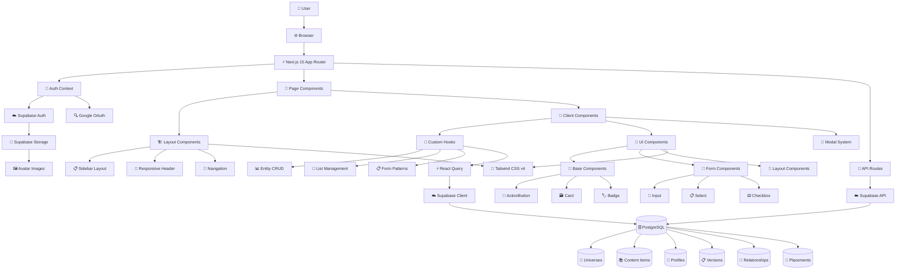
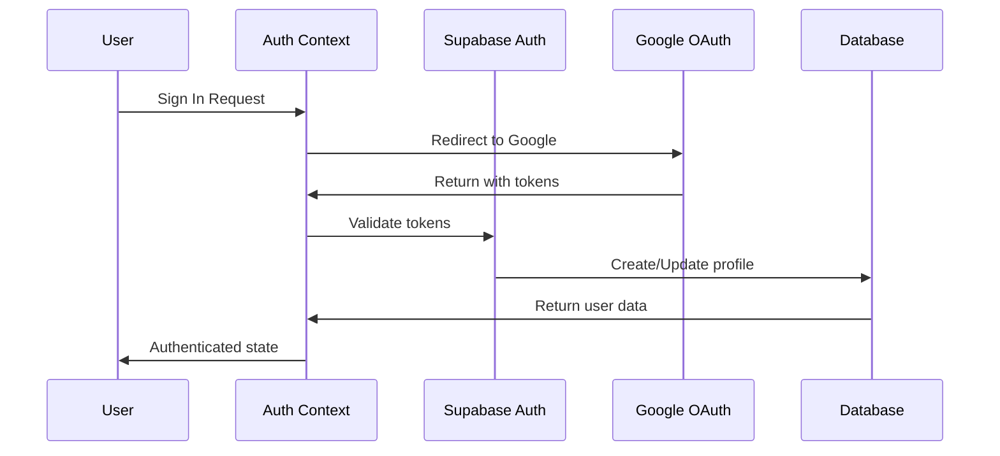
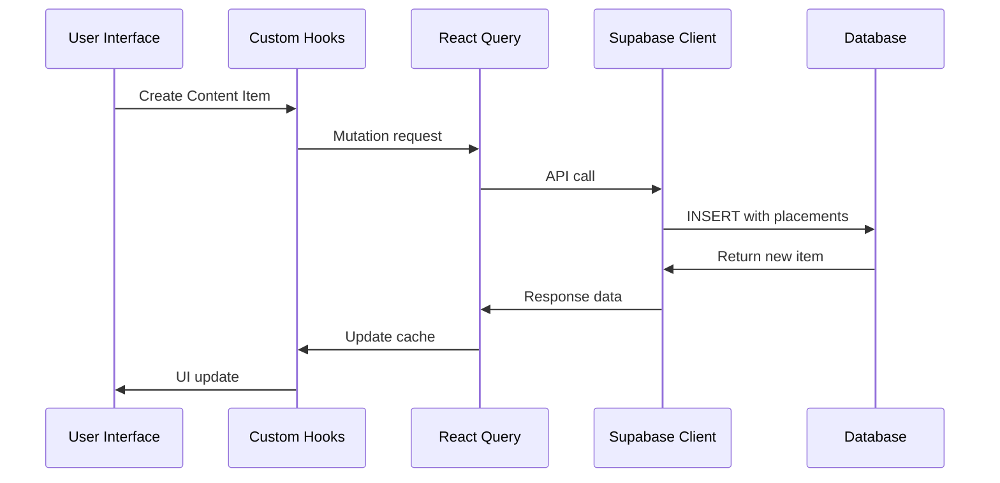
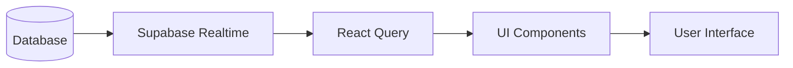
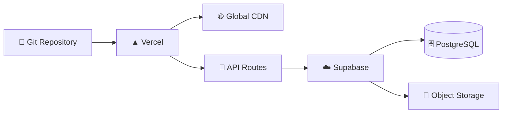

# CanonCore Architecture Guide

## Overview

CanonCore is a modern content organisation platform for expanded universes built with Next.js 15, Supabase, and TypeScript. This document provides a comprehensive understanding of the system architecture, data flow, and component relationships.

## System Architecture Diagram



## Core Architecture Patterns

### 1. **App Router Structure** (`/app`)

```
app/
├── layout.tsx                    # Root layout with providers
├── page.tsx                      # Landing page
├── [username]/                   # Dynamic user routes
│   ├── page.tsx                 # User dashboard
│   └── [slug]/                  # Universe routes
│       ├── page.tsx             # Universe detail
│       └── content/[contentId]/ # Content detail
├── auth/                        # Authentication pages
└── public-universes/            # Public discovery
```

**Key Concepts:**
- **Dynamic routing** with `[username]/[slug]` pattern
- **Layout composition** with nested layouts
- **Client-side components** for interactive features
- **Server components** for data fetching and SEO

### 2. **Component Hierarchy**

```
Page Component (Server)
├── Layout Components
│   ├── SidebarLayout
│   │   ├── NavigationSidebar
│   │   └── ResponsiveHeader
│   └── DetailPageLayout
├── Client Components
│   ├── ContentTree
│   ├── UniverseCard
│   └── Modal System
└── UI Components
    ├── ActionButton
    ├── Input/Select/Checkbox
    └── Card/Badge/Loading
```

### 3. **Custom Hook Architecture** (81 exports across 23 files)

```
Hooks Hierarchy:
├── 🏗️ Generic CRUD Foundation
│   └── use-entity-crud.ts (6 exports)
├── 🔄 Entity Management
│   ├── use-universes.ts (5 exports)
│   ├── use-content-items.ts (6 exports)
│   ├── use-content-versions.ts (6 exports)
│   └── use-content-links.ts (7 exports)
├── 🎯 Specialized Features
│   ├── use-list-management.ts (7 exports)
│   ├── use-page-data.ts (3 exports)
│   └── use-profile.ts (5 exports)
└── 🔧 Utility Patterns
    ├── use-form-patterns.ts (5 exports)
    ├── use-media-query.ts (5 exports)
    └── use-confirmation-modal.ts (1 export)
```

## Data Flow Patterns

### 1. **User Authentication Flow**



### 2. **Content Management Flow**



### 3. **Real-time Updates**



## Key Features & Implementation

### 1. **Hierarchical Content System**

- **Multi-placement support**: Content can appear in multiple locations
- **Infinite nesting**: Unlimited hierarchy depth
- **Drag & drop reordering**: Visual tree manipulation
- **Placement management**: Add/remove content from different parents

**Implementation:**
```typescript
// content_placements table enables many-to-many relationships
interface ContentPlacement {
  content_item_id: string
  parent_id: string | null  // null = root level
  order_index: number
  universe_id: string
}
```

### 2. **Version Management System**

- **Git-like versioning**: Snapshots with commit messages
- **Primary version system**: One active version per content item
- **Universe versioning**: Snapshot entire universe states
- **Time travel**: Switch between different universe versions

### 3. **Relationship System**

- **Built-in types**: sequel, prequel, spinoff, reference, etc.
- **Custom types**: Universe-specific relationship types
- **Bidirectional links**: Automatic reverse relationship handling
- **Type management**: Enable/disable types per universe

### 4. **Public Universe Discovery**

- **Privacy controls**: Public/private universe settings
- **User attribution**: Profile integration with avatars
- **Context navigation**: Maintain browsing context across pages
- **Badge system**: Visual indicators for ownership

## Component Standardization

### UI Component System

```
components/ui/
├── base/           # Core interactive elements
│   ├── action-button.tsx
│   ├── card.tsx
│   ├── badge.tsx
│   └── user-avatar.tsx
├── forms/          # Form controls
│   ├── input.tsx
│   ├── textarea.tsx
│   ├── checkbox.tsx
│   └── select.tsx
├── layout/         # Layout utilities
│   ├── header.tsx
│   ├── stack.tsx
│   └── grid.tsx
└── feedback/       # User feedback
    ├── toast.tsx
    └── loading.tsx
```

**Standardization Principles:**
- **Consistent styling**: Tailwind CSS with design tokens
- **TypeScript interfaces**: Full type safety
- **Variant systems**: Primary, secondary, danger, ghost, etc.
- **Size systems**: sm, md, lg, xl for responsive design
- **Accessibility**: ARIA labels and keyboard navigation

### Form Component Architecture

```typescript
// Standardized form components with consistent API
interface InputProps {
  label?: string
  error?: string
  helpText?: string
  size?: 'sm' | 'md' | 'lg'
  variant?: 'default' | 'error'
}

// Generic form modal system
interface FormField {
  name: string
  type: 'text' | 'textarea' | 'select' | 'checkbox'
  label: string
  validation?: ValidationRule[]
  options?: SelectOption[] // for select fields
}
```

## Database Schema Overview

### Core Tables

```sql
-- User management
profiles (id, username, full_name, bio, avatar_url)

-- Content hierarchy
universes (id, name, slug, user_id, is_public)
content_items (id, title, slug, description, universe_id)
content_placements (content_item_id, parent_id, order_index)

-- Versioning system
universe_versions (id, universe_id, version_number, snapshot_data)
content_versions (id, content_item_id, title, description, is_primary)

-- Relationship system
content_links (id, from_item_id, to_item_id, relationship_type)
custom_relationship_types (id, universe_id, name, description)

-- Type management
custom_organisation_types (id, universe_id, name, emoji)
disabled_organisation_types (universe_id, type_name)
```

### Row Level Security (RLS)

- **User isolation**: Users can only access their own data
- **Public universe access**: Public universes readable by all users
- **Profile visibility**: Basic profile info accessible for attribution
- **Secure mutations**: Write operations require proper ownership

## Development Guidelines

### 1. **File Organization Patterns**

```
feature/
├── components/     # Feature-specific components
├── hooks/         # Custom hooks for the feature
├── types/         # TypeScript definitions
└── utils/         # Helper functions
```

### 2. **Component Patterns**

- **Server Components**: Data fetching, SEO, initial rendering
- **Client Components**: Interactivity, state management, user actions
- **Hook Composition**: Combine multiple hooks for complex features
- **Prop Threading**: Pass props through component hierarchies

### 3. **State Management**

- **React Query**: Server state, caching, optimistic updates
- **React Context**: Global state (auth, toast notifications)
- **useState/useReducer**: Local component state
- **Custom Hooks**: Encapsulated stateful logic

### 4. **Error Handling**

- **Try-catch blocks**: Async operation error handling
- **Error boundaries**: Component-level error catching
- **Toast notifications**: User-friendly error messages
- **Form validation**: Real-time input validation

## Performance Considerations

### 1. **Code Splitting**

- **Dynamic imports**: Lazy-loaded components and pages
- **Route-based splitting**: Automatic with Next.js App Router
- **Component-level splitting**: Large modals and complex features

### 2. **Data Fetching Optimization**

- **React Query caching**: Intelligent cache management
- **Parallel fetching**: Multiple queries in page components
- **Optimistic updates**: Immediate UI feedback
- **Background refetching**: Keep data fresh

### 3. **Bundle Optimization**

- **Tree shaking**: Remove unused code
- **Image optimization**: Next.js Image component
- **CSS optimization**: Tailwind CSS purging
- **Compression**: Gzip and modern formats

## Security Model

### 1. **Authentication**

- **Supabase Auth**: JWT-based authentication
- **Google OAuth**: Social login integration
- **Session management**: Automatic token refresh
- **Route protection**: Middleware-based guards

### 2. **Authorization**

- **Row Level Security**: Database-level access control
- **API route protection**: Server-side auth checks
- **Client-side guards**: UI-level access control
- **Resource ownership**: User-based data isolation

### 3. **Data Validation**

- **TypeScript**: Compile-time type checking
- **Zod schemas**: Runtime validation
- **Database constraints**: Data integrity enforcement
- **Sanitization**: XSS prevention

## Deployment Architecture



**Production Stack:**
- **Frontend**: Vercel (Next.js hosting)
- **Database**: Supabase (Managed PostgreSQL)
- **Authentication**: Supabase Auth
- **Storage**: Supabase Storage (Avatar images)
- **CDN**: Vercel Edge Network

This architecture provides a scalable, maintainable, and user-friendly platform for managing complex content hierarchies with modern web technologies.